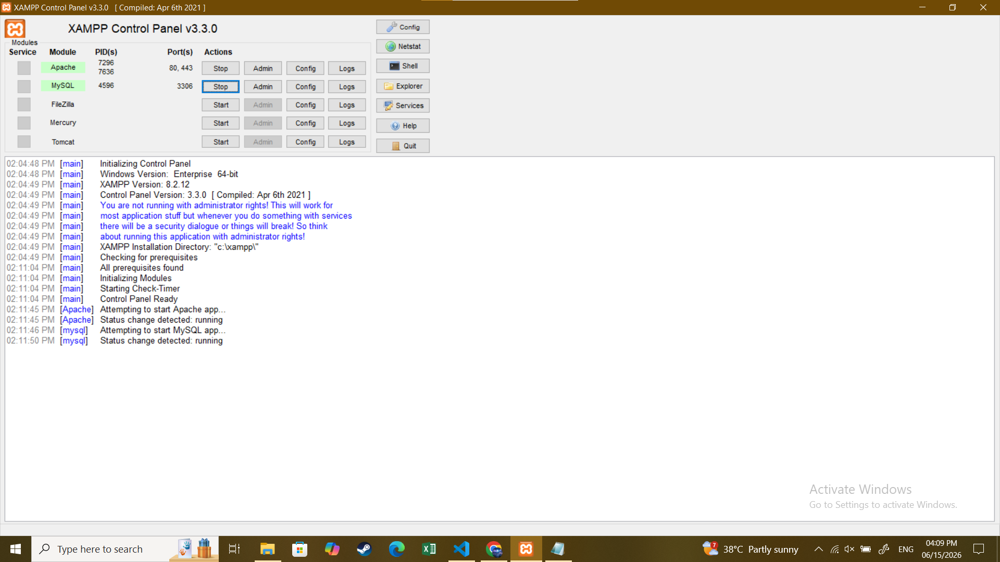
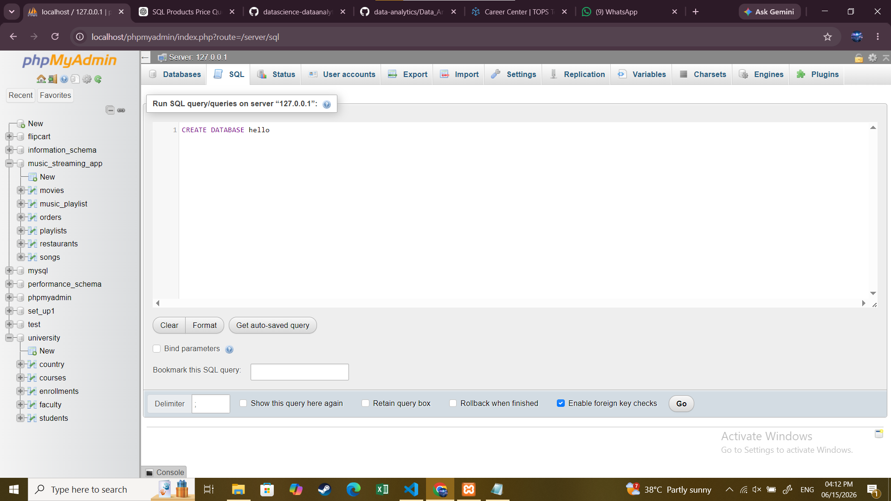
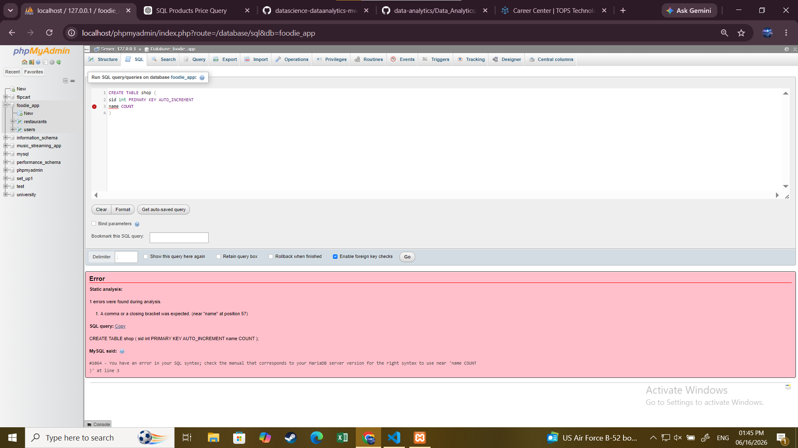

1. Install MySQL Community Server or SQLite on your system and verify the installation by connecting to the database using the command line or a GUI tool like MySQL Workbench or DB Browser for SQLite.

 

 

 ***

 CREATE DATABASE hello
 

 ***

2. Create a new database named 'foodie_app' to simulate a Zomato-style backend.

  ***
    CREATE DATABASE foodie_app
  ***

3. Write a CREATE TABLE statement to define a 'restaurants' table in the 'foodie_app' database with the following columns: id (integer, primary key), name (varchar/character, max 100), cuisine (varchar/character, max 50), rating (decimal, e.g., 4.5), and location (varchar/character, max 100).
 ***

 CREATE TABLE restaurants (
 rid int PRIMARY KEY AUTO_INCREMENT,
 name varchar(255),
 cuisine varchAR(255),
 rating decimal,
 location varchar(255)
 )

 
 ***

4.Design and create a 'users' table for a Flipkart-style app with columns: user_id (primary key), username, email, phone_number, and created_at (date/time). Pick appropriate data types for each column. Think about which columns should be unique and which data types best fit email and phone numbers.
 
 ***
  
  CREATE TABLE users (
 user_id int PRIMARY KEY AUTO_INCREMENT,
 username varchar(255),
 email varchar(255),
 phone_number int,
 created_date date
 )
  

  ***

5.Intentionally make a mistake in your CREATE TABLE statement (such as missing a comma or using an unsupported data type), run it, and then fix the error based on the message you receive. Take a screenshot of the error and the corrected SQL statement for your records.

 # correct statment
  ***
    
    CREATE TABLE shop (
    sid int PRIMARY KEY AUTO_INCREMENT,
    name varchar(255)
    ) 
  ***