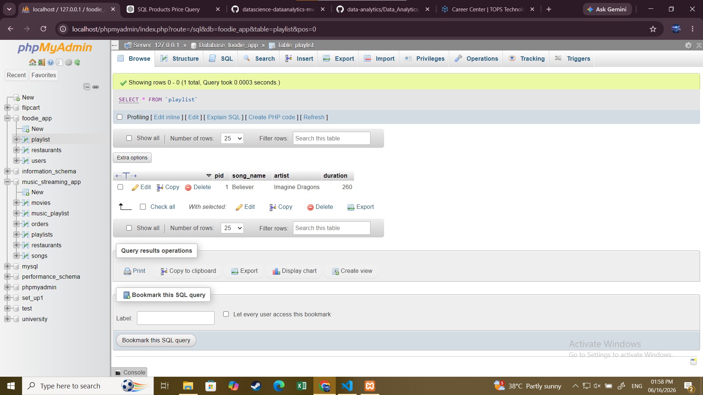

1. Create a table called Playlist with columns: id (INT, primary key), song_name (VARCHAR), artist (VARCHAR), and duration (INT, seconds). Insert a single row for your current favorite song.

 # table
***
     CREATE TABLE Playlist (
     pid int PRIMARY KEY AUTO_INCREMENT,
     song_name varchar(255),
     artist varchar(255),
     duration int 
     )
    
 ***

2. Insert 3 new rows into the Playlist table for songs you recently listened to on Spotify, including their song_name, artist, and duration.
  

   *** 
       INSERT INTO Playlist (song_name, artist, duration)
VALUES
('Kesariya', 'Arijit Singh', '00:04:28'),
('Blinding Lights', 'The Weeknd', '00:03:20'),
('Perfect', 'Ed Sheeran', '00:04:23');

   ***

     

3. Update the artist name for one of your Playlist entries to fix a typo (for example, change 'Arjit Singh' to 'Arijit Singh') using the UPDATE statement with a WHERE clause.

    ***

      UPDATE playlist set artist= 'Arijit Singh' 'Arjit Singh' WHERE pid=1
   
     ***
   

4. Delete a song from the Playlist table where the duration is less than 120 seconds using the DELETE statement and a WHERE clause. Make sure your WHERE clause is specific so you don’t accidentally delete all rows.

   ***

     DELETE FROM playlist WHERE pid=3
  
    ***

5. Write an SQL statement that would update the song_name for all songs by 'AP Dhillon' in your Playlist to add '(Remix)' at the end of the name, but only if the duration is more than 180 seconds. Combine UPDATE with WHERE to target only the correct rows.

  ***
    UPDATE playlist set song_name= concat(song_name, 'remix') WHERE artist='AP Dhillon' and duration>180

    ***
