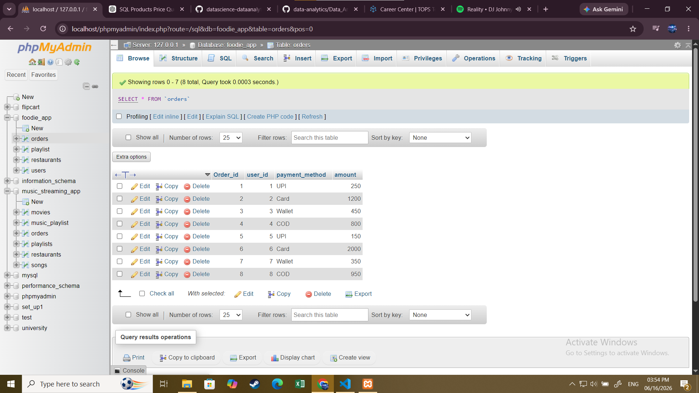

1. Create a table called Orders with columns: order_id, user_id, payment_method, and amount. Insert at least 8 sample records representing different users and payment methods (like UPI, Card, Wallet, COD).

 # table
  ***
      CREATE TABLE Orders (
Order_id int PRIMARY KEY AUTO_INCREMENT,
user_id int AUTO_INCREMENT,
payment_method varchar (255),
amount int
)

   ***      
   
   

2. Write an SQL query to count how many orders were placed using each payment_method in the Orders table, similar to how Zomato shows payment breakdown in analytics.

   ***
     
     SELECT payment_method, COUNT(*) AS order_count FROM orders GROUP BY payment_method;

     ***

3. Write an SQL query to find the total amount spent by each user_id in the Orders table. Display user_id and their total spend.

  ***
  
      SELECT user_id, sum(amount) FROM orders GROUP BY user_id;

   ***

4. Write an SQL query to show only those payment methods where the average order amount is greater than 300, using GROUP BY and HAVING. Use AVG(amount) in your HAVING clause.

   ***

     SELECT payment_method,
       AVG(amount) AS avg_amount
FROM orders
GROUP BY payment_method
HAVING AVG(amount) > 300;

***

5. Explain the difference between WHERE and HAVING by giving one example query for each, using the Orders table. Your examples should show a scenario where WHERE and HAVING filter different things.

  # WHERE

   ***

   WHERE filters rows before grouping and aggregation.

   ***

   # EXAMPLE
     
      ***

       SELECT *
FROM Orders
WHERE amount > 500;

   ***

   # HAVING

 ***

   HAVING filters groups after GROUP BY and aggregation.

 
 ***

   # EXAMPLE

  ***

  SELECT payment_method,
       AVG(amount) AS avg_amount
FROM Orders
GROUP BY payment_method
HAVING AVG(amount) > 500;

 
 ***
