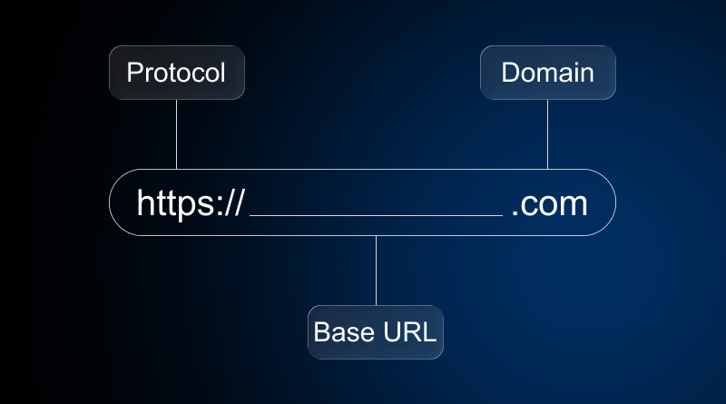

# what is URL ? 
  
  1. URL stands for uniform resource locator 
  2. URL open your web apps o web server
  3. URL write https://www.flipkart.com

# types of url ?

  1. absolute URL 

     absolute url is main url which is open our web apps first home page or landing page 

     examples : https://www.flipkart.com

  2. relative URL 
    
     relative url is  url which is open our multiple web pages inside of any web apps 

     examples : https://www.flipkart.com/viewcart
                or 
                https://www.flipkart.com/signIn
                or
                https://www.flipkart.com/signUp

# architectures of URL 

   
  