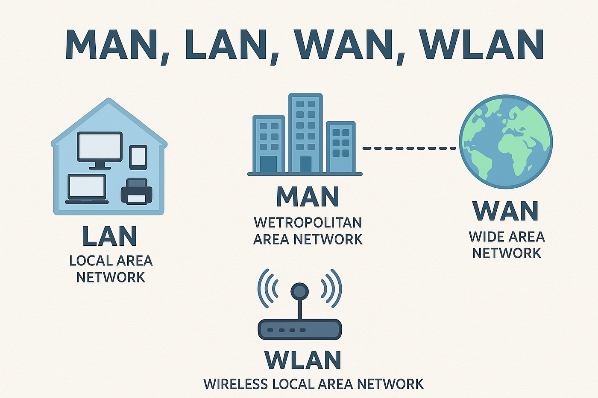

# what is LAN , WAN and MAN ?

1. WAN (Wide Area Network): A WAN is a network that spans a large geographical area, such as a city, country, or even the entire world. It connects multiple LANs together and allows communication between devices that are far apart. The internet is an example of a WAN, as it connects millions of devices globally.

2. MAN (Metropolitan Area Network): A MAN is a network that spans a larger geographical area than a LAN but smaller than a WAN. It typically connects multiple LANs within a city or metropolitan area. MANs are often used by organizations to connect their branch offices or to provide high-speed internet access to businesses in a specific region.

3. LAN (Local Area Network): A LAN is a network that connects devices within a limited geographical area, such as a home, office, or campus. It allows devices to communicate and share resources like files, printers, and internet connections. LANs typically use Ethernet or Wi-Fi technology for connectivity.

