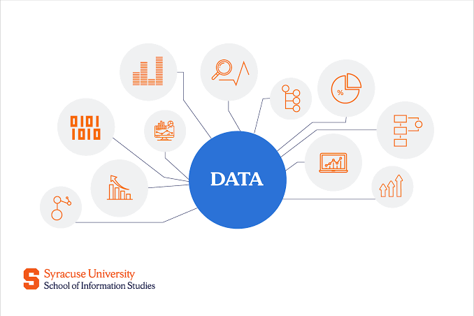

# what is data ?

1. Data refers to facts, figures, or information that can be collected, analyzed, and used for various purposes. It can be in the form of numbers, text, images, audio, video, or any other type of information that can be stored and processed by computers.

2. Data is the raw material that is used to create information and knowledge. It can be collected from various sources such as sensors, surveys, social media, and many other sources.

3. data is an collection of information that can bre used to make decisions, solve problems, and gain insights. It is the foundation of many fields such as science, business, and technology.

# types of data

1. structured data: This type of data is organized in a specific format and can be easily stored and processed by computers. It includes data that is stored in databases, spreadsheets, and other structured formats.


 ```

    table
name   age   city
john   25    new york
jane   30    london
   excel sheet
name   age   city
john   25    new york
jane   30    london
    CSV file
  name,age,city
 john,25,new york
 jane,30,london

 ```

# unstructured data: 

1. This type of data does not have a specific format and is not organized in a way that can be easily processed by computers. It includes data such as text documents, images, audio files, and video files.

```
   text document
   "This is an example of unstructured data. It does not have a specific format and can contain any type of information."

   image file
   (an image file such as a JPEG or PNG)

   audio file
   (an audio file such as an MP3 or WAV)

   video file
   (a video file such as an MP4 or AVI)

``` 


# raw data:

1. Raw data refers to data that has not been processed, cleaned, or analyzed. It is the original form of data that is collected from various sources and has not been transformed in any way. Raw data can be in the form of structured or unstructured data, and it may contain errors, inconsistencies, or missing values. It is often necessary to clean and preprocess raw data before it can be used for analysis or decision-making.

   ```

    raw data example:
    name,age,city
    john,25,new york
    jane,30,london
    (this is an example of raw data that has not been processed or cleaned. It may contain errors or inconsistencies that need to be addressed before it can be used for analysis.)
    
    ```

